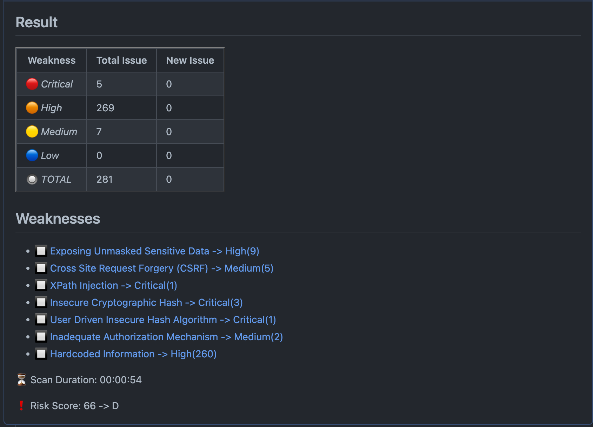

# Identify issues in your code with CodeThreat


[CodeThreat](https://codethreat.com) SAST solution has seamless integration with the [GitHub Actions](https://github.com/features/actions). While it's fairly easy to start security scans and working on the issues found on your code, this document provides details of the integration. 

With CodeThreat custom rule engine, we have wide language and framework support without sacrificing quality.

## Requirements

* A [CodeThreat](https://codethreat.com) account. Contact info@codethreat.com if you don't have one yet.
* Aaand that's all! Now you are ready to jump!

## Usage

Create a YAML file, such as the one below, `.github/workflows/ct.yml` under your source code project root directory. You can tailor the action triggers and `FAILED_ARGS` according to your needs.

```yaml
on:
  # Trigger scan when pushing in master or pull requests, and when creating
  # a pull request.
  pull_request:
      branches:
        - main
  push: 
        branches:
        - main
jobs:
  codethreat_scanner:
    runs-on: ubuntu-latest
    name: Codethreat Github Actions
    steps:
      - name: Check Out Source Code
        uses: actions/checkout@v3
      - name: Install Node.js
        uses: actions/setup-node@v1
      - name: CodeThreat Scanner
        uses: CodeThreat/codethreat-scan-action@master
        env:
           ACCESS_TOKEN: ${{ secrets.ACCESS_TOKEN }}
           GITHUB_TOKEN: ${{ secrets.GITHUB_TOKEN }}
           CT_SERVER: ${{ secrets.CT_SERVER }}
           USERNAME: ${{ secrets.USERNAME }}
           PASSWORD: ${{ secrets.PASSWORD }}
        with: 
            FAILED_ARGS: |
                 - max_number_of_critical: 4
                 - max_number_of_high: 20
                 - weakness_is: ".*injection,buffer.over.read,mass.assigment"
                 - condition: 'OR'
                 - automerge: true

```

* As the name implies `FAILED_ARGS` contains the conditions for which you want to break the pipeline (action).

* In `env` section, you can use either the ACCESS_TOKEN or USERNAME,PASSWORD pair as one of the authentication method.

* Mininum one  `FAILED_ARGS` fields is required. If more args are provided, they will be `AND`ed together.

* `weakness_is` fields expects either a wildcard or a direct weakness id. Please checkout KStore section of  [CodeThreat](https://codethreat.com) portal application.

## Args

| Variable  | Example Value &nbsp;| Description &nbsp; | Type | Required | Default |
| ------------- | ------------- | ------------- |------------- | ------------- | ------------- |
| max_number_of_critical | 5 | Failed condition for maximum critical number of found issues | Number | No | N/A
| max_number_of_high | 20 | Failed condition for maximum high number of found issues | Number | No | N/A
| weakness_is | ".*injection,buffer.over.read,mass.assigment" | Failed condition for found issues weakness id's. | String | No | N/A
| automerge | true | If automerge is active and scan returns success, it allows PR to merge automatically . | Boolean | No | false
| condition | "OR" | It checks failed arguments(max_number_of_critical, max_number_of_high)  using with "and" or "or". | String | No | AND


### Secrets

- `ACCESS_TOKEN` – A given JWT token when you logged in your account in access_token field.

- `USERNAME` –  Your CodeThreat Account's username.

- `PASSWORD` – Your CodeThreat Account's passowrd.

- *`GITHUB_TOKEN` – It's provided by the github when action triggers. You do not need to add it separately from the secrets tab.

## Example of pull request check out comment


