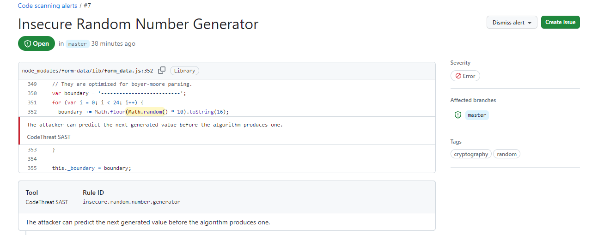

# CodeThreat GitHub Action

<p align="center">
  <a href="https://codethreat.com">
    
  </a>
</p>

[CodeThreat](https://codethreat.com) SAST solution has seamless integration with [GitHub Actions](https://github.com/features/actions). This action performs Static Application Security Testing (SAST) and generates detailed security reports.

## Features

- 🔒 Automated SAST scanning
- 📊 SARIF report generation
- 🔍 Detailed vulnerability findings
- 🚦 Customizable failure conditions
- 🔄 CI/CD integration
- 📝 GitHub Checks integration

## Requirements

* A [CodeThreat](https://codethreat.com) account. Contact info@codethreat.com if you don't have one yet.
* GitHub repository with source code
* GitHub Actions enabled

## GitHub Security Feed Example



## Quick Start

1. Add your CodeThreat credentials to GitHub Secrets:
   - `ACCESS_TOKEN` – Your CodeThreat Account's token
   - `CT_SERVER` – CodeThreat API server URL
   - `ORGNAME` – Your CodeThreat Account's organization name
   - `USERNAME` (optional) – Your CodeThreat Account's username (if not using ACCESS_TOKEN)
   - `PASSWORD` (optional) – Your CodeThreat Account's password (if not using ACCESS_TOKEN)
   - `GITHUB_TOKEN` – Automatically provided by GitHub Actions

2. Create a workflow file (e.g., `.github/workflows/codethreat.yml`):

```yaml
name: CodeThreat Security Scan

on:
  push:
    branches: [ main ]
  pull_request:
    branches: [ main ]

permissions: write-all  # Required for GitHub token permissions

jobs:
  security_scan:
    runs-on: ubuntu-latest
    name: Security Scan
    steps:
      - uses: actions/checkout@v3
      
      - name: CodeThreat Scan
        uses: CodeThreat/codethreat-scan-action@v1
        env:
          ACCESS_TOKEN: ${{ secrets.ACCESS_TOKEN }}
          CT_SERVER: ${{ secrets.CT_SERVER }}
          ORGNAME: ${{ secrets.ORGNAME }}
          GITHUB_TOKEN: ${{ secrets.GITHUB_TOKEN }}
        with:
          FAILED_ARGS: |
            - max_number_of_critical: 23
            - max_number_of_high: 23
            - sca_max_number_of_critical: 23
            - sca_max_number_of_high: 23
            - weakness_is: ".*injection,buffer.over.read,mass.assigment"
            - condition: 'OR'
            - automerge: false
            - sync_scan: true
            - policy_name: Advanced Security

      - name: Upload SARIF file
        uses: github/codeql-action/upload-sarif@v2
        with:
          sarif_file: codethreat.sarif.json
```

## Configuration

### Environment Variables

| Variable | Description | Required | Notes |
|----------|-------------|----------|--------|
| `ACCESS_TOKEN` | CodeThreat API token | Yes* | Either ACCESS_TOKEN or USERNAME/PASSWORD required |
| `CT_SERVER` | CodeThreat API server URL | Yes | |
| `ORGNAME` | Organization name | Yes | |
| `USERNAME` | CodeThreat username | No* | Required if not using ACCESS_TOKEN |
| `PASSWORD` | CodeThreat password | No* | Required if not using ACCESS_TOKEN |
| `GITHUB_TOKEN` | GitHub token | Auto | Automatically provided by Actions |

### FAILED_ARGS Configuration

The `FAILED_ARGS` input allows you to configure when the action should fail based on scan results:

| Parameter | Type | Description | Default | Required |
|-----------|------|-------------|---------|----------|
| `max_number_of_critical` | Number | Max critical findings allowed | N/A | No |
| `max_number_of_high` | Number | Max high findings allowed | N/A | No |
| `sca_max_number_of_critical` | Number | Max critical SCA findings allowed | N/A | No |
| `sca_max_number_of_high` | Number | Max high SCA findings allowed | N/A | No |
| `weakness_is` | String | Regex for weakness types | N/A | No |
| `condition` | String | How to combine conditions ('AND'/'OR') | 'AND' | No |
| `automerge` | Boolean | Auto-merge PR if scan passes | false | No |
| `sync_scan` | Boolean | Wait for scan completion | true | No |
| `policy_name` | String | Security policy to apply | 'Advanced Security' | No |

### GitHub Token Permissions

The `GITHUB_TOKEN` requires specific permissions to function properly. You can set these in two ways:

1. Repository Settings:
   - Go to Settings > Actions > General
   - Under "Workflow permissions", select "Read and write permissions"

2. Workflow File:
   - Add `permissions: write-all` to your workflow file
   - Or specify individual permissions as needed

## Usage Examples

### Basic Scan

```yaml
- name: CodeThreat Scan
  uses: CodeThreat/codethreat-scan-action@v1
  env:
    ACCESS_TOKEN: ${{ secrets.ACCESS_TOKEN }}
    CT_SERVER: ${{ secrets.CT_SERVER }}
    ORGNAME: ${{ secrets.ORGNAME }}
```

### Custom Failure Conditions

```yaml
- name: CodeThreat Scan
  uses: CodeThreat/codethreat-scan-action@v1
  env:
    ACCESS_TOKEN: ${{ secrets.ACCESS_TOKEN }}
    CT_SERVER: ${{ secrets.CT_SERVER }}
    ORGNAME: ${{ secrets.ORGNAME }}
  with:
    FAILED_ARGS: |
      - condition: 'AND'
      - max_number_of_critical: 0
      - max_number_of_high: 5
      - weakness_is: '.*sql.*injection'
      - sync_scan: true
```

### Pull Request Integration

```yaml
- name: CodeThreat Scan
  uses: CodeThreat/codethreat-scan-action@v1
  env:
    ACCESS_TOKEN: ${{ secrets.ACCESS_TOKEN }}
    CT_SERVER: ${{ secrets.CT_SERVER }}
    ORGNAME: ${{ secrets.ORGNAME }}
  with:
    FAILED_ARGS: |
      - automerge: true
      - max_number_of_critical: 0
```

## Development

### Setup

1. Clone the repository
2. Install dependencies: `npm install`

### Testing

```bash
# Run tests
npm test
```

## Contributing

Please read our [Contributing Guidelines](CONTRIBUTING.md) for details on our code of conduct and the process for submitting pull requests.

## License

This project is licensed under the MIT License - see the [LICENSE](LICENSE) file for details.

## Support

- Open an issue for bugs
- Visit [CodeThreat Documentation](https://docs.codethreat.com)
- Contact support@codethreat.com